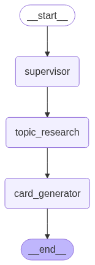

# AutoAnki

A minimal, runnable system for generating flashcards using LLMs via **Ollama** or **Hugging Face**, LangGraph, and FastAPI.

## Architecture

```
[Supervisor Agent] → [Topic Research Agent] → [Card Generator Agent] → JSON Output
```

- **Supervisor Agent**: Receives natural language instructions and coordinates the workflow
- **Topic Research Agent**: Generates a mini lesson or summary on the given topic
- **Card Generator Agent**: Creates 3-5 flashcards in JSON format from the mini-lesson content

## Tech Stack

- **FastAPI**: Backend API
- **LangGraph**: Agent orchestration
- **LangChain**: LLM integration
- **Model Providers**:
  - **Ollama**: Local LLM (deepseek-r1:8b, mistral, etc.)
  - **Hugging Face**: Cloud-based inference API

## Quick Start

### Prerequisites

1. **Install Poetry**: [https://python-poetry.org/](https://python-poetry.org/)
2. **Choose your model provider**:
   - **Option A**: Install Ollama for local models: [https://ollama.ai/](https://ollama.ai/)
   - **Option B**: Get a Hugging Face API key: [https://huggingface.co/settings/tokens](https://huggingface.co/settings/tokens)

### Setup

1. **Clone and install dependencies**:
   ```bash
   git clone <your-repo>
   cd AutoAnki
   poetry install
   ```

2. **Configure environment**:
   ```bash
   # Copy the template and edit with your settings
   cp env.template .env
   # Edit .env with your preferred text editor
   nano .env
   ```

3. **Choose and setup your model provider**:

   #### Option A: Ollama (Local)
   ```bash
   # In .env file, set:
   # MODEL_PROVIDER=ollama
   # OLLAMA_MODEL=deepseek-r1:8b
   
   # Start Ollama and pull model
   ollama serve
   # In another terminal:
   ollama pull deepseek-r1:8b
   ```

   #### Option B: Hugging Face (Cloud)
   ```bash
   # In .env file, set:
   # MODEL_PROVIDER=huggingface
   # HUGGINGFACE_API_KEY=your_actual_api_key
   # HUGGINGFACE_MODEL=microsoft/DialoGPT-medium
   
   # No additional setup needed!
   ```

4. **Test the system**:
   ```bash
   python test_system.py
   ```

5. **Start the FastAPI server**:
   ```bash
   python start_server.py
   # Or manually:
   # poetry run uvicorn backend.main:app --reload
   ```

## Environment Configuration

### .env File Setup

The system uses a `.env` file to configure model providers and settings. Copy `env.template` to `.env` and modify the values:

```bash
# Model Provider - choose "ollama" or "huggingface"
MODEL_PROVIDER=ollama

# Ollama Configuration (when using local models)
OLLAMA_MODEL=deepseek-r1:8b
OLLAMA_BASE_URL=http://localhost:11434

# Hugging Face Configuration (when using cloud API)
HUGGINGFACE_API_KEY=your_api_key_here
HUGGINGFACE_MODEL=microsoft/DialoGPT-medium

# Optional: Logging and API settings
LOG_LEVEL=INFO
ENABLE_FILE_LOGGING=true
API_HOST=0.0.0.0
API_PORT=8000
```

### Supported Models

#### Ollama Models (Local)
- `deepseek-r1:8b` - Recommended for complex reasoning
- `mistral:latest` - Fast and efficient
- `llama2:latest` - Popular general-purpose model
- Any other Ollama-compatible model

#### Hugging Face Models (Cloud)
- `microsoft/DialoGPT-medium` - Conversational model (free)
- `microsoft/DialoGPT-large` - Larger conversational model (free)
- `mistralai/Mistral-7B-Instruct-v0.1` - Instruction-following (free)
- `meta-llama/Llama-2-7b-chat-hf` - Chat model (may require approval)

**Note**: Hugging Face Inference API has rate limits for free usage. Consider upgrading for production use.

### Switching Providers

To switch between providers, simply update your `.env` file:

```bash
# Switch to Hugging Face
MODEL_PROVIDER=huggingface
HUGGINGFACE_API_KEY=your_key

# Switch to Ollama  
MODEL_PROVIDER=ollama
OLLAMA_MODEL=deepseek-r1:8b
```

Then restart the server. The system will automatically detect and use the new provider.

## Usage

### API Endpoints

#### Generate Flashcards
```bash
curl -X POST "http://localhost:8000/generate-flashcards" \
     -H "Content-Type: application/json" \
     -d '{
       "instruction": "Generate flashcards about the French Revolution",
       "model_name": "deepseek-r1:8b"
     }'
```

#### Health Check
```bash
curl http://localhost:8000/health
```

### Example Response

```json
{
  "instruction": "Generate flashcards about the French Revolution",
  "mini_lesson": "The French Revolution (1789-1799) was a period of radical social and political upheaval...",
  "flashcards": [
    {
      "question": "When did the French Revolution begin?",
      "answer": "1789",
      "category": "fact"
    },
    {
      "question": "What was the main cause of the French Revolution?",
      "answer": "Social inequality and financial crisis",
      "category": "concept"
    }
  ],
  "status": "card_generation_complete",
  "workflow_info": {
    "agent": "card_generator",
    "timestamp": "2024-01-01T00:00:00Z"
  }
}
```

## Development

### Project Structure

```
AutoAnki/
├── agents/
│   ├── supervisor_agent.py      # Coordinates workflow
│   ├── topic_research_agent.py  # Generates mini lessons
│   ├── card_generator_agent.py  # Creates flashcards
│   └── langgraph_orchestrator.py # Orchestrates agents
├── backend/
│   └── main.py                  # FastAPI server
├── test_system.py               # Test script
└── pyproject.toml              # Dependencies
```

## Workflow Graph



### Adding New Models

To use a different Ollama model:

1. Pull the model: `ollama pull mistral`
2. Update the model name in your request or test script
3. The system will automatically use the specified model

### Debugging

Each agent returns intermediary output as a dictionary, making it easy to debug:

- Check `test_results.json` after running the test script
- Use the `/health` endpoint to verify system status
- Monitor the FastAPI logs for detailed error messages

## Future Enhancements

- Database integration for storing generated flashcards
- Anki integration via MCP
- Web UI with Streamlit
- Support for different flashcard formats
- Batch processing capabilities

## Troubleshooting

### Common Issues

#### Configuration Issues
1. **"Configuration Error"**: Check your `.env` file exists and has valid settings
2. **"HUGGINGFACE_API_KEY is required"**: Set a valid Hugging Face API key in `.env`
3. **"Invalid MODEL_PROVIDER"**: Set `MODEL_PROVIDER` to either "ollama" or "huggingface"

#### Ollama Issues
1. **"Orchestrator not initialized"**: Make sure Ollama is running (`ollama serve`)
2. **"Model not found"**: Pull the required model (`ollama pull deepseek-r1:8b`)
3. **Connection refused**: Check if Ollama is running on the correct port (11434)

#### Hugging Face Issues
1. **"Unauthorized"**: Verify your API key is correct and active
2. **"Model loading"**: Some models need time to load; the system will retry automatically
3. **Rate limit exceeded**: You've hit the free tier limits; wait or upgrade your plan

#### General Issues
1. **Import errors**: Run `poetry install` to install dependencies
2. **"No module named 'dotenv'"**: Run `poetry install` to install python-dotenv

### Logs

The system provides detailed logging with centralized configuration:
- **Console logs**: Real-time status with emojis and clear messages
- **File logs**: Complete history in `logs/autoanki.log`
- **Error logs**: Critical issues in `logs/autoanki_errors.log`
- **Debug mode**: Set `LOG_LEVEL=DEBUG` in `.env` for verbose output

### Provider Status Check

Use the `/models` endpoint to check your current configuration:

```bash
curl http://localhost:8000/models
```

This will show:
- Current provider (Ollama/Hugging Face)
- Current model name
- Provider-specific status (API key validity, Ollama connection, etc.)
